 

---

##  $ whoami

---

##  Arsenal

### 🟣 Offense

### 🔵 Defense & SOC

### 🧬 Reverse Engineering & Malware

### 🎮 Playground

### ⚙️ Stack

---

##  Stats

  

---

##  Featured

<table align="center">
<tr>
<td width="50%">

### 🔍 [FiveM-Backdoor-find](https://github.com/VozDeOuro/FiveM-Backdoor-find)
Malware & backdoor detector for FiveM script plugins — static analysis of obfuscated Lua payloads.

 

</td>
<td width="50%">

### 🤖 [scripts](https://github.com/VozDeOuro/scripts)
Automation scripts for home server ops — monitoring, maintenance, media pipeline glue.

 

</td>
</tr>
<tr>
<td width="50%">

### 🚀 [LCSV_Launcher](https://github.com/VozDeOuro/LCSV_Launcher)
Custom Minecraft launcher in C++ with self-hosted update distribution.

 

</td>
<td width="50%">

### 🐧 [dotfiles-public](https://github.com/VozDeOuro/dotfiles-public)
Arch Linux dotfiles — shell, terminal, and tooling config.

 

</td>
</tr>
</table>

---

##  Contribution Snake

<picture>
  <source media="(prefers-color-scheme: dark)" srcset="assets/github-snake-dark.svg" />
  <source media="(prefers-color-scheme: light)" srcset="assets/github-snake.svg" />
  
</picture>

